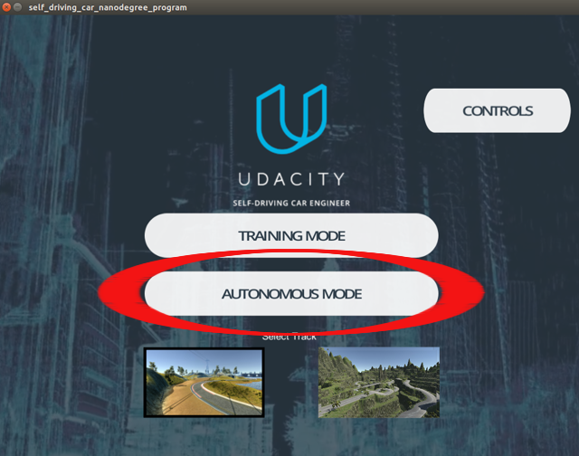
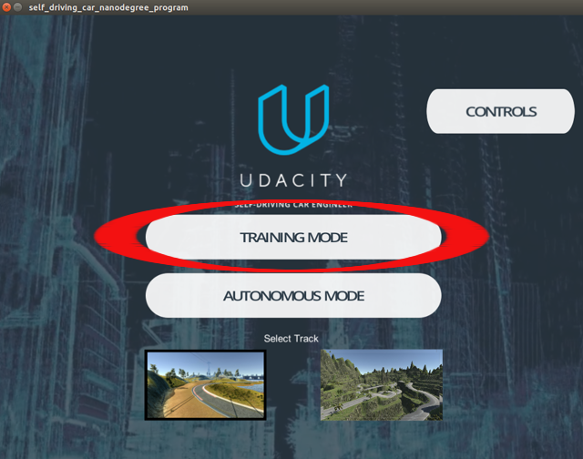
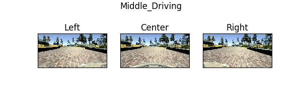
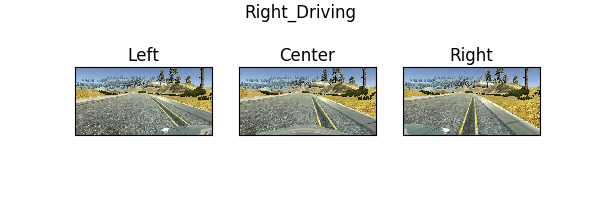
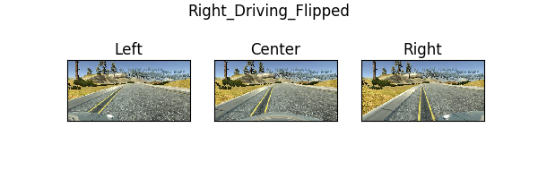
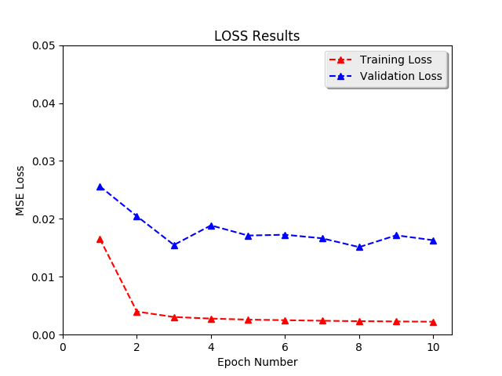

# Practical Behavioral Cloning

.gif)

## Overview
In this project, I will use CNN Deep Learnig to clone driving behavior. I will train, validate and test a model using Keras. The model will output a steering angle to an autonomous vehicle.

I am using a [simulator](https://github.com/udacity/self-driving-car-sim) - Version 1, 12/09/16 - where you can steer a car around a track for data collection. You'll use image data and steering angles to train a neural network and then use this model to drive the car autonomously around the track.

## Goals
The goals / steps of this project are the following:
* Use the simulator to collect data of good driving behavior
* Build, a convolution neural network in Keras that predicts steering angles from images (model.py)
* Train and validate the model with a training and validation set (model.py)
* Test that the model successfully drives around track one without leaving the road (drive.py)
* Summarize the results with a written report (this README.md file)
* video.mp4 (a video recording of my vehicle driving autonomously around the track for one full lap)

By continuing to read this README file, I will describes how to output the final video.mp4.

## Dependencies
* python 3
* numpy
* matplotlib
* Pickle
* pillow (PIL)
* scikit-learn
* h5py
* Pickle
* TensorFlow
* Keras
* Udacity [simulator](https://github.com/udacity/self-driving-car-sim)

`environment.yml` shows the exact environment that I used here. Please note the for using GPU you need to do some initial preparations which are not in the scope of this writeup.
If you want to know how to set up the GPU environment, I highly recommend to use the Docker's images! [This](https://blog.amedama.jp/entry/2017/04/03/235901) is a good starting point.
Also, if you need more help, please don't hesitate to contact me! I'll do my best to come back to you quickly.

## How to run this project

Run `python drive.py model.json` in a terminal and then, you need to run the [simulator](https://github.com/udacity/self-driving-car-sim) and choose the `AUTONOMOUS MODE`. 

Then, you will see the car will start to move like the gif video provided on the top of this page.

## Project Explanation

### 1. Main Files

My project includes the following files:
* make_data_for_training.sh containing the script to preprocess all the data and make the data for training
* model.py containing the script to create and train the model
* drive.py for driving the car in autonomous mode
* model.h5 containing a trained convolution neural network 
* README.md as a complete report

### 2. How to create and train your own model and run it
1. Run the provided Udacity [simulator](https://github.com/udacity/self-driving-car-sim) and select training mode to run the car:

Infront of this car, three cameras are located which are recording the images in left/center/right directions like this:

	 \|/
	  X

Where `X` shows the car and `\|/` shows the camera direction in lef, center, and right, respectively.

2. Save the driving images data for these cases at least for one round:
	- Left   driving:	|| x | - | - ||  --> I did one round!
	- Middle driving:       || - | x | - ||  --> I did two rounds!
	- Right  driving:	|| - | - | x ||  --> I did one round!

`X` shows the car location in the road `|| ... ||`. 

For more understanding, I've provided these images for each case:

3. Open `make_data_for_training.sh` and comple the following:
	- dir_workspace: the directory where this package is in it
	- dir_left_side_driving: the directory to the recorded left side driving data
	- dir_middle_side_driving: the directory to the recorded middle side driving data
	- dir_right_side_driving: the directory to the recorded right side driving data

`make_data_for_training.sh` contains the script to preprocess all the data (e.g. flipping) and make the data ready for training.

4. Run `python model.py` to creat train the CNN model.
5. Run `python drive.py model.json` in a terminal and then, you need to run the simulator and choose the `AUTONOMOUS MODE`. Then, you will see the car will start to move like.

### 3. How to preprocessed the collected data?

One of the best ways to to add useful information to train your model is data augmentation. Here, I do the the data augmentation by flipping the images horizontally and inverting the related steering angles. This will double the data size and reduces any bias towards turning left/right.

After that, do the following for:
	- Middel side driving data: Keep the center labled images and correct the steering angle for the right/left labled images  by -+0.15 to keep the car in the middle of the road for small deviations. Finally, we smooth the steering angle over time using a moving average function to avoid sharp changes during the auto mode.
	
	- Right/Left side driving data: Remove the center labeled images and images whose steering angle is zero. Then correct the steering angle for the right/left labled images  by adding -+0.5 to keep the car to turn to the middle of the road in case of passing the road side lines. Finally, we smooth the steering angle over time using a moving average function to avoid sharp changes during the auto mode.
	

### 4. Model Architecture and Training Strategy
There has been prior work done to predict vehicle steering angles from camera images, such as NVIDIA's "End to End Learning for Self-Driving Cars" (http://images.nvidia.com/content/tegra/automotive/images/2016/solutions/pdf/end-to-end-dl-using-px.pdf), and comma.ai's steering angle prediction model (https://github.com/commaai/research/blob/master/train_steering_model.py). Here, I used the comma.ai's steering angle prediction model.

#### Model Architecture
The CNN model that I used here has the following layers and information:

Layer (type)                 Output Shape              Param #   
-----------------------------------------------------------------
lambda_1 (Lambda)            (None, 160, 320, 3)       0         
Scale all image pixel values 
within the range [-1, 1]
_________________________________________________________________
conv2d_1 (Conv2D)            (None, 40, 80, 16)        3088  
(8x8 kernel, same padding)
_________________________________________________________________
elu_1 (ELU)                  (None, 40, 80, 16)        0       
_________________________________________________________________
conv2d_2 (Conv2D)            (None, 20, 40, 32)        12832 
(5x5 kernel, same padding)    
_________________________________________________________________
elu_2 (ELU)                  (None, 20, 40, 32)        0         
_________________________________________________________________
conv2d_3 (Conv2D)            (None, 10, 20, 64)        51264
(5x5 kernel, same padding)    
_________________________________________________________________
flatten_1 (Flatten)          (None, 12800)             0         
_________________________________________________________________
dropout_1 (Dropout)          (None, 12800)             0
(0.2 drop)       
_________________________________________________________________
elu_3 (ELU)                  (None, 12800)             0         
_________________________________________________________________
dense_1 (Dense)              (None, 512)               6554112   
_________________________________________________________________
dropout_2 (Dropout)          (None, 512)               0
(0.5 drop)         
_________________________________________________________________
elu_4 (ELU)                  (None, 512)               0         
_________________________________________________________________
dense_2 (Dense)              (None, 1)                 513       
-----------------------------------------------------------------
Total params: 6,621,809
Trainable params: 6,621,809
Non-trainable params: 0

The model follows the standard design practice for CNNs: the base convolutional layers' height and width progressively decrease while its depth increases, and the final layers are a series of fully-connected layers. Dropout layers were included right before the fully-connected layers, to help reduce overfitting.

#### Training Strategy
Validating Your Network:
In order to validate your network, you need to compare model performance on the training set and a validation set. The validation set should contain image and steering data that was not used for training. A rule of thumb could be to use 80% of your data for training and 20% for validation or 70% and 30%. But here, because of small model size, I used 90% of your data for training and 10% for validation. Also, randomly shuffle the data before splitting into training and validation sets is a good practice.

If model predictions are poor on both the training and validation set (for example, mean squared error is high on both), then this is evidence of underfitting. Possible solutions could be to:

* increase the number of epochs
* add more convolutions to the network.

When the model predicts well on the training set but poorly on the validation set (for example, low mean squared error for training set, high mean squared error for validation set), this is evidence of overfitting. If the model is overfitting, a few ideas could be to

* use dropout or pooling layers
* use fewer convolution or fewer fully connected layers
* collect more data or further augment the data set

Ideally, the model will make good predictions on both the training and validation sets. The implication is that when the network sees an image, it can successfully predict what angle was being driven at that moment.

Generator:
The images captured in the car simulator are much larger than the images encountered in the [Traffic Sign Classifier Project](https://github.com/Sj-Amani/TrafficSign_Classifier), a size of 160 x 320 x 3 compared to 32 x 32 x 3. Storing 10,000 traffic sign images would take about 30 MB but storing 10,000 simulator images would take over 1.5 GB. That's a lot of memory! Not to mention that preprocessing data can change data types from an int to a float, which can increase the size of the data by a factor of 4.

Generators can be a great way to work with large amounts of data. Instead of storing the preprocessed data in memory all at once, using a generator you can pull pieces of the data and process them on the fly only when you need them, which is much more memory-efficient.Here, a python `generator` was used to generate batches of data and the images themselves were read from disk only when new batch was requested.

Optimizer:
An `adam optimizer` was used to minimize the mean squared error (MSE). The optimizer's learning rate was not extensively tuned, but a learning rate of 1e-4 produced stable results. The loss function was MSE because predicting steering angles is a regression problem.

Regularization:
The comma.ai model specified dropout layers and their associated drop probabilities used here.

Loss results:
For training the model, the epochs number and batch size were 10 and 16, repectively. During the training, the training and validation loss calculations show a decreasing trend:

Testing Your Network:
Once you're satisfied that the model is making good predictions on the training and validation sets, you can test your model by launching the simulator and entering autonomous mode. For testing, I just test the model on the simulator but you can define a test model for your self if you want. Please note that durig the test, if your model has low mean squared error on the training and validation sets but is driving off the track, this could be because of the data collection process. It's important to feed the network examples of good driving behavior so that the vehicle stays in the center and recovers when getting too close to the sides of the road.

References:
---
https://github.com/PaulHeraty/BehaviouralCloning
http://stackoverflow.com/a/14314054
https://github.com/georgesung/behavioral_cloning
https://classroom.udacity.com/nanodegrees
https://arxiv.org/abs/1412.6980v8

Referencing This Project
---
If you like my code and you want to use it in your project, please refer it like this:

`Amani, Sajjad. "Train an Autonomous Vehicle by CNN Deep Learning to Drive Like Humans." GitHub, 3 November 2019, https://github.com/Sj-Amani/Practical_Behavioral_Cloning`
